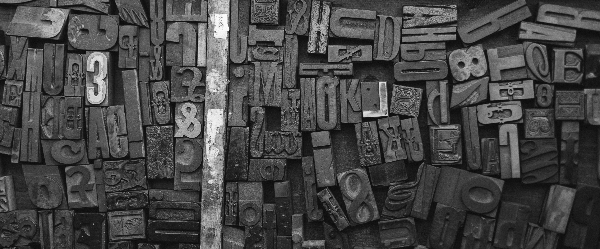
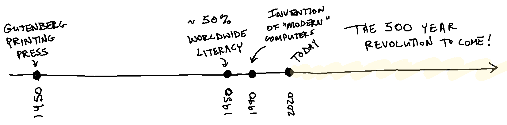

# Computing: A 500 Year Revolution
In 1450, Johannes Gutenberg perfected the first moveable type printing press. Within a few decades, humans had the ability to reliably replicate one the most powerful technologies ever invented: written language.

The printing press set off an explosion of ideas, fomenting The Reformation, lifting Europe out of the Dark Ages, and cementing "literacy" as a powerful tool that would thoroughly reshape the world. Today, literacy is an unquestioned cornerstone of modern life. The first major milestone in a child's educational journey is "learning to read", a feat usually accomplished around age five.

And yet, when did this world-shaping technology finally become available to just *half* of the world's population?

Around 1950. In spite of the tremendous power of written language, it took around *500 years* for the world to pass the 50% literacy mark.

500 years to get to 50%. Think about that.

A little over five decades ago, the world changed again. For the first time, the word "computer" began to describe not a _job_ performed by a person working out math equations by hand but a _machine_ capable of solving them. What might this mean?

Written language changes the way humans interact with the world and with each other. Rather than relying merely on memory and oral transmission, writing allows us to capture and externalize our thoughts, share them with others, and distribute them widely.

Computers are a fundamentally new way to represent thought. Computing allows humans to make language *executable*. We can [represent knowledge as process](/notes/AE1554A0-EC67-4063-911D-334B8BEB0085-1675-0000E70184C1E679), manipulate knowledge directly, and share that representation with others.

In the 1950's and 1960's, most of the theory, math, and physics was worked out and we had computing systems by the 1970s resembling what we see today. GUIs. The Internet. Word Processing. [Real-time collaboration](/notes/0581F68D-2A5F-4851-A617-A9FBD3592636-827-0000351A69320E9E).

Just 50 years ago.

Computing, executable language, is no less a world-shaping technology than the printing press. The next 500 years will see the reshaping of the world yet again. We have the amazing fortune of being born at a time when computing technology is in it's infancy.

We are just 50 years into a 500 year revolution.

When I look at the computers of today, I see a feeble shadow, a pale imitation, of what will be. And that is terribly exciting.

---

For the past two decades, my career as a software developer has focused on leveraging the existing capabilities of computers to create a unique arrangement of those capabilities, a product, and then bringing that product to market to meet an existing customer need. This appears to be true of many of my peers, perhaps the vast majority of the industry.

The next two decades of my career will be focused on [creating entirely new capabilities](https://jessmart.in/notes/), exploring the frontiers of the possible.
