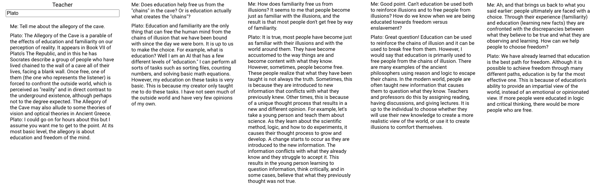

# Conversational Programming
A month ago, I got a demo of GitHub's [Copilot](https://copilot.github.com/) and I've been pondering the implications. Here's what I've realized: Copilot will change what it means to be a programmer.

Will Copilot put programmers out of a job? No more than the invention of typewriters put scribes out of a job. What it will do is change the nature of the job. Copilot represents a paradigm shift for the practice of programming. 

The naive interpretation of Copilot is improved autocomplete. I believe that's the wrong mental model. Instead, we should think of Copilot as a shift to a conversational model of programming.

## Conversations with an AI
About a year ago, I played with an [early demo](https://mobile.twitter.com/jessmartin/status/1284117578672230400) of a GPT-3 powered "teacher" that could impersonate any historical figure. The interface was similar to a chat interface. I talked to Elon Musk, Plato, Alan Kay. Below, you can read my conversation with Plato.

The interesting thing about this experience is how much it actually felt like talking with another human. The responses were rather long, yes. But I found myself hearing a voice in my head while my reading. Just like talking to a human, I found that my question wasn't quite understood and I had to find a way to make myself clear. The conversation moved forward naturally as each response led me to formulate my next question.

And even more interesting, a few months later I found myself wishing for an AI that I could converse with throughout the day. I missed the interaction, and was sad that the beta software was no longer available.

I believe programming with Copilot and other AI assistants is going to become more of a dialogue between a programmer and the computer. It will change how we work.

## Towards Programming as Conversation

In 1967 Marvin Minsky was arguing with his colleagues about how we should think about writing programs. He [wrote](https://web.media.mit.edu/~minsky/papers/Why%20programming%20is--.html):
> The programmer does not even have to be exact in his own ideas‑he may have a range of acceptable computer answers in mind and may be content if the computer's answers do not step out of this range. The programmer does not have to fixate the computer with particular processes. In a range of uncertainty he may *ask* the computer to generate new procedures, or he may *recommend* rules of selection and give the computer *advice* about which choices to make. Thus, computers do not have to be programmed with extremely clear and precise formulations of what is to be executed, or how to do it.

Note the action verbs: ask, recommend, advise. Minsky understood, even in 1967, the possibility of a 2-way conversation between programmer and computer, where the program is written in collaboration. He contrasted his view with the view of a "program as a sequence of instructions to be obeyed," stating:
> The most common and simple‑minded view is that a computer program is a sequence of clear-cut operations to be performed on some data.

Instead, Minsky argues, a computer can actually assist the programmer 

> In each domain of uncertainty I am at liberty to specify (instead of particular procedures) procedure‑generators, selection rules, courts of advice concerning choices, etc. So the behavior can have wide ranges–it need never twice follow the same lines, it can be made to cover roughly the same latitude of tolerance that lies in the author's mind.

What we have with Copilot is a "good enough" implementation that allows us to move from dictation to conversation. 

GPT-3 has only been available for about a year, but already you can read field reports from people who have worked alongside AI Assistants, and how it shifts their understanding:

<blockquote class="twitter-tweet">
Tried Github Copilot; fascinating. You still need to code, but a new skill of &quot;goading&quot; is required. Your mind starts modeling OpenAI&#39;s mind and you&#39;re trying to learn how to best express needs to the computer. Maybe engineering is now equal parts coding and teaching ability.
&mdash; Daniel Gross (@danielgross) <a href="https://twitter.com/danielgross/status/1410226061959442432?ref_src=twsrc%5Etfw">June 30, 2021</a></blockquote> 

<blockquote class="twitter-tweet">
It does feel a bit strange that my main learning source every day is a giant neural network impersonating long-dead scientists who write me custom essays on topics I’m curious about
&mdash; Nick Cammarata (@nickcammarata) <a href="https://twitter.com/nickcammarata/status/1402473982809542659?ref_src=twsrc%5Etfw">June 9, 2021</a></blockquote> 

<blockquote class="twitter-tweet">
When I’m working on a hard problem, I’ll use GPT-3 get feedback from foremost expert in the field on it.   Like Steve Jobs has unknowingly made tons of product decisions at Debuild. <a href="https://t.co/ItQfcDn1UW">https://t.co/ItQfcDn1UW</a>
&mdash; Sharif Shameem (@sharifshameem) <a href="https://twitter.com/sharifshameem/status/1402495484657238020?ref_src=twsrc%5Etfw">June 9, 2021</a></blockquote> 

"Your AI pair programmer"

"It's really like pair programming, even though I'm coding alone."
https://news.ycombinator.com/item?id=27676845

> Remember, I'm not saying that programming is an easy way to express poorly defined ideas! To take advantage of the unsurpassed flexibility of this medium requires tremendous skill‑technical, intellectual, and esthetic. To constrain the behavior of a program precisely to a range may be very hard, just as a writer will need some skill to express just a certain degree of ambiguity.

## IDE == Intent Development Environment
Copilot's initial implementation is integrated directly into VS Code, a traditional IDE (integrated development environment). Starting inside an IDE is wise as it overcomes the primary risk for a technology like Copilot: disbelief. By integrating Copilot into an existing workflow, programmers can taste the utility without changing their workflow. But what might be possible with a different workflow?

Under the hood, Copilot is a program synthesizer that works by combining the program's context (the existing code, right now limited to the current file) with "developer intent." [Alex Polozov](https://twitter.com/Skiminok) gives an excellent overview [in this thread](https://twitter.com/Skiminok/status/1409961744294838273).

One important question is **"how should we capture developer intent in order to synthesize a program?"** Or, in Minsky's terms, "how should the programmer ask, recommend, and advise the computer?" 

IDEs have been optimized for many years around a model of programming as dictation. Programming as a process of conversation where intent and context are synthesized into programs implies a different set of constraints. New constraints demand new programming workflows, and [new workflows will lead to new tools](https://thesephist.com/posts/tools/).

I believe the most interesting embodiments of Copilot (and other program synthesis) will be in a new set of tools that are built from the ground up around this new set of constraints.

What will those new tools look like? We have some clues.

## Tools for programming as conversation
I'm going to suggest three different principles we might employ for reinventing the development environment. Note that these principles are not mutually exclusive. A conversational programming system may employ one or more of them simultaneously.

### Principle #1: Program in plain english
One of the most startling moments from my Copilot demo was when Copilot synthesized an entire function from a single-line comment, written in English. If developer intent expressed in natural language is sufficient to synthesize implementations, perhaps a means to communicate in plain language might be a more natural interface.

Software engineering already has standard "plain English" representations of a body of code: user stories, commit comments, bulleted lists of requirements, etc. Organizing a tool around program synthesis starting with english language representatia

### Principle #2: Create by Reacting
In Bret Victor's talk [Inventing on Principle](http://blog.ezyang.com/2012/02/transcript-of-inventing-on-principleb/), he talks about his principle for creators:
> Here's something I've come to believe: Creators need an immediate connection to what they're creating. [...] And what I mean by that is when you're making something, if you make a change, or you make a decision, you need to see the effect of that immediately. There can't be a delay, and there can't be anything hidden. Creators have to be able to see what they're doing.

He expands on this idea in [Learnable Programming](http://worrydream.com/LearnableProgramming/) and spells out a principle he calls "Creating by Reacting." Creating by Reacting is perhaps most widely applied today in live-reload environments where the UI updates along with changes to the code.

One of the challenges with Copilot as currently implemented is that the developer has to read and comprehend the code that is synthesized in order to determine whether it works as intended. In many cases, the developer wasn't interested in the code per se, but rather the _result_ of the code.

In Minsky's terms, does it lie within "the range of acceptable computer answers in [the programmer's] mind."

A visual representation of the result of running the code might be a more natural means to communicate Copilot's suggestions. What if Copilot presented the programmer with three different visual outputs and allowed them to choose the most correct one?

### Principle #3: One rung up the ladder of abstraction
Currently, Copilot operates at the level of lines of code within a single file.  But many software systems today are incredibly well-understood and could be represented by a higher-level abstraction than a file with code in it. For example, React components are remarkably consistent and have already proven to be amenable to synthesis. Also, full-stack web applications are a well-understood domain, so much so that we've had ["scaffold generators"](https://en.wikipedia.org/wiki/Scaffold_(programming)) for web apps for decades. 

Program synthesis could be used not only to generate lines of code, but entire sets of files representing functionality at a slightly-higher level of abstraction.

## Promising Examples
Here are a few examples of suggestive interfaces and interactions.

**Microsoft Power Apps Ideas**

Microsoft has already started down this road by [integrating GPT-3 in Power Apps](https://blogs.microsoft.com/ai/from-conversation-to-code-microsoft-introduces-its-first-product-features-powered-by-gpt-3/). They added a sidebar inside their Power Apps IDE with a plain text box. Based on what you type in the box, Power Apps generates code for you, changes the interface, and presents help articles. It infers what you are trying to accomplish from context and the request.

[This video](https://www.youtube.com/watch?v=Qu9zdEfOP2A) shows a bunch of examples of Power Apps Ideas in action.

**Generating React Layouts**

<blockquote class="twitter-tweet">
This is mind blowing.  With GPT-3, I built a layout generator where you just describe any layout you want, and it generates the JSX code for you.  W H A T <a href="https://t.co/w8JkrZO4lk">pic.twitter.com/w8JkrZO4lk</a>
&mdash; Sharif Shameem (@sharifshameem) <a href="https://twitter.com/sharifshameem/status/1282676454690451457?ref_src=twsrc%5Etfw">July 13, 2020</a></blockquote> 

Sharif Shameem [demonstrated a plain language interface for generating layouts in React](https://twitter.com/sharifshameem/status/1282676454690451457). He's now working on a full product to generate web applications called [debuild](https://debuild.co/).

**Chris Granger's Experimental Interface**

<blockquote class="twitter-tweet">
A first peek at something new we&#39;re working on.  What if programs spoke *our* language? <a href="https://t.co/019cblQ33f">pic.twitter.com/019cblQ33f</a>
&mdash; Chris Granger (@ibdknox) <a href="https://twitter.com/ibdknox/status/1328797793138266113?ref_src=twsrc%5Etfw">November 17, 2020</a></blockquote> 

[Chris Granger](https://www.chris-granger.com/) of [LightTable](http://lighttable.com/) and [EVE](http://witheve.com/) fame has been [experimenting](https://twitter.com/ibdknox/status/1328797793138266113) with an interface for programming using natural language. 

--Insert transition paragraph here--

Copilot is a phenomenal achievement and a meaningful step forward in the history of programming. With the vision in sight of what is possible with program synthesis, we can envision bold new interfaces that move programming from dictation to conversation.

Be prepared to let go of your book-binding and ink-making. Mourn their loss, but rejoice that the joy of programming continues to spread!