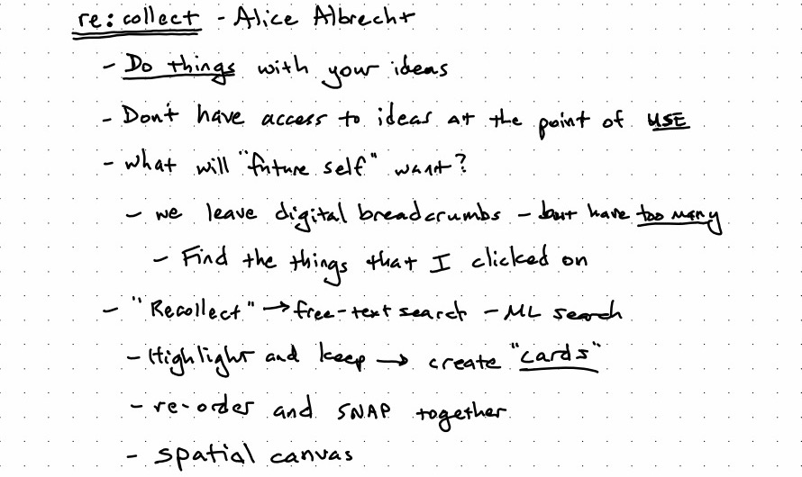

# Betaworks Render Conference - August 16, 2022

A few years ago, when I first got interested in developing new thinking tools, I met with Linus Lee, Andy Matuschak, Alan Kay and others. One of my main questions was "where do I find a group of like-minded individuals working on this problem?" In other words, where's the _scene_ at? Who thinks like this? What are they reading? What are they experimenting with? Where do they hang out? A few years ago, there weren't any good answers to that question. It's not that there weren't people _doing the work_. They were simply scattered. As [Jerry Michalski]() put it during the [introductory session](#jerry-michalski-and-john-borthwicks-introduction): "there are embers of interest at the edges, but no bonfire in the middle." 

Enter the [Render Conference](https://www.betaworks.com/event/render-tools-for-thinking), stage right. The BetaWorks office on Tuesday, August 16th was packed with around 75 technologists, many building tools for thought products or experiments. Some already knew each other and greeted one another as old friends. Many did not, glancing furtively around the room, wondering who to talk to. Most knew _of_ others primarily through twitter and newsletters. The primary "scene" for Tools for Thought-interested folks of the last few years has been held together with tweets and blog posts. In a single office in Manhattan a scene was gathering, getting to know one another through conversations and shared demos. Render felt like sparks flung onto a pile of dry wood; whether it ignites that bonfire remains to be seen.

In this update, I'll skim across the main talks and demos and include [some take-aways](#themes) at the end. The main livestream is available [here]() as one long, 6-hour recording. Once it's cut into individual videos and re-posted, I will embed links to the individual talks below.

## Jerry Michalski and John Borthwick's Introduction
[John Borthwick](https://twitter.com/Borthwick) is the founder of [Betaworks](https://www.betaworks.com/), a venture studio that invests, accelerates and builds companies. Betaworks has been operating for 15 years; they know a thing or two about getting new products and technologies off the ground.

[Jerry Michalski](https://www.jerrymichalski.com/) has been building a single mind map for over 25 years. You can explore it at JerrysBrain.com.

Betaworks will be hosting [ThinkCamp](https://www.betaworks.com/camp) this fall, a 10-week accelerator program for Tools for Thinking startups. 8-10 companies, $250k pre-seed investment. Applications due by August 26th. Jerry will be helping Betaworks in some capacity with ThinkCamp.

## A Readwise Rewrite: Tristan Howsi and Daniel Doyon
[Tristan](https://twitter.com/homsiT) and [Daniel](https://twitter.com/deadly_onion) started [Readwise](https://readwise.io/) back in 2017, with the goal of helping people read better with software. Their initial core product loop was importing your highlights from Kindle and then feeding those into a spaced repetition system, effectively resurfacing the important parts of what you read, as determined by you. This led to "can I get these highlights in Evernote" and, amidst the cambrian explosion of note-taking apps, Readwise has found itself in an interesting position.

Readwise itself has become a "switching station", a Zapier, if you will, for highlights and quotes among many different tools. People consume media, highlighting and taking notes on it, whether it's on a Kindle, YouTube, or a PDF. The want those highlights and notes to make it into a production tool: Roam, Evernote, Notion, whatever. And from their production tool, they create. Readwise has the odd honor of being the "man in the middle", a key component in many people's workflows.

John invited them to give an overview of recent TFT history, from the 2000's to now. The divided recent TFT history into several major innovations:
- 2000's - Evernote: save everything and search it!
- 2016 - Notion: block-based architecture + multiplayer
- 2020 - Roam: graph databases, backlinks, and transclusions

They haven't seen any major innovations since 2020. What's next?

Readwise grew with some good ol' fashioned bootstrapping: just charging customers monthly. Their product didn't have "venture scale" (a grave insult in Silicon Valley, but as we were in NYC I suppose it was OK). They lamented the difficult reality of "consumer SaaS" and the inability to find a way to break into the enterprise and thus upgrade to "the greatest business model of all-time: enterprise SaaS." Are there different funding models that could be explored now? They certainly hope so.

They also gave a demo of [their beta Reader app](https://blog.readwise.io/readwise-reading-app/) that they built from the ground up. It's basically a custom web browser (cue the rise of domain-specific browsers!) focused on reading all sorts of mediums. It's quite impressive. I'd recommend reading this [post from last September](https://blog.readwise.io/readwise-reading-app/): it goes into great detail about their goals and approach in building their new product.

## Noosphere: A Protocol for Thought from Gordon Brander
Rather than recapping Gordon's talk, I thought I'd just embed the slides below. 

<iframe src="https://docs.google.com/presentation/d/e/2PACX-1vSrgALX7moywYmggJxo1Q-ZnX_1-c69311enwhaRMSFayCwIrOX24d5lBZE8kjog0rfjrTW17OYahgX/embed?start=false&loop=false&delayms=3000" frameborder="0" width="960" height="569" allowfullscreen="true" mozallowfullscreen="true" webkitallowfullscreen="true"></iframe>

If you're interested in learning more about Noosphere, [join the Discord](https://discord.com/invite/wyHPzGraBh).

## Howard Rheingold and a trip into TFT History

## Demos

The product demos were fun.

### Plexus Notes demoed by Davey Morse

No notes.

### re:collect demoed by Alice Albrecht

### Jerry's Brain demoed by Jerry Michalski

### Sentence Gradients demoed by Linus Lee

## AI and ML in Building New Thinking Tools: A Conversation with Linus Lee and Alice Albrecht

## The Hallway Track

- Darlene Dang and EDVO

## Themes

After musing on the conference for a few days, in particular some of the "hallway track" conversations and the dinner afterwards, a few themes stood out to me. While these weren't the subject of any one of the talks, they did thread through all of them.

### Interop All The Things
Throughout the day, there was a lot of discussion on how these tools will talk to each other and share data. 

**From Silos to Portfolios.** In their "the recent history of TFTs", the Readwise founders noted a shift in the last two years from a "one app to rule them all" approach to a "portfolio" approach. In their experience, in 2020, people had the idea that they were going to do _everything_ inside a single app: read and highlight, write, create graphs, spaced repetition, everything. Over the last few years, it seems that people have moved away from that and are instead looking at a portfolio of tools, working together, to build their workflows. _But how to get those tools to talk to one another?_

**Noosphere: A Protocol For Multiplayer.** Noosphere is designed to solve the interop problem at the protocol level, creating a simple HTTP-like interface for publishing and ingesting text.

A key problem for the future is to figure out how to get our tools to talk to one another. And that's not even touching on multiplayer or [scaling synthesis](https://scalingsynthesis.com/): how do we get the individual tools that we use as part of our workflows to talk to one another?

### "We're so early."
"None of the things demoed today will make a dent out there," said one attendee as he gestured out the front door of Betaworks office. "I haven't seen anything that really impressed me." I was a bit startled by the remark, but I had to remind myself that the current state of these early tools is what Paul Graham wrote about in [Early Work](http://www.paulgraham.com/early.html): 
> Many great projects go through a stage early on where they don't seem very impressive, even to their creators. You have to push through this stage to reach the great work that lies beyond. But many people don't.

The current ideas that are being explored are little _idea babies_. They are young, needy, and unimpressive. They have to be nurtured, protected, and cared-for if they are to grow to maturity. The slightest mis-placed step can snuff them out. 

Why do I think we're early? A lot of reasons. We are still struggling to understand what computers as a medium are capable of. What are the limits? What is now possible, simply unexplored?

A flood of new technologies has opened new doors in the [adjacent possible](https://medium.com/@SeloSlav/what-is-the-adjacent-possible-17680e4d1198): machine learning and artificial intelligence, powerful browser APIs like FileSystem, decentralized technologies flowing out of web3 like IPFS. Not to mention advances in hardware, proliferation in devices and platforms, computing devices everywhere. And each of those advances *interacts* with the others in surprising ways. We have a lot of unexplored ground to cover!

Tuesday's batch of talks and demos were glimpses of a shared vision of the future, a world where humans work seamlessly together computers in symbiosis. But they were no more than glimpses. A lot of hard work lies ahead. And some of that hard work is protecting this early work:
> Another way to get through the lame phase of ambitious projects is to surround yourself with the right people — to create an eddy in the social headwind. But it's not enough to collect people who are always encouraging. You'd learn to discount that. You need colleagues who can actually tell an ugly duckling from a baby swan. The people best able to do this are those working on similar projects of their own, which is why university departments and research labs work so well. You don't need institutions to collect colleagues. They naturally coalesce, given the chance. But it's very much worth accelerating this process by seeking out other people trying to do new things.

### Interface is the key
A consistent refrain throughout the day was "yes, but what's the interface for that look like?" A tool is inseparable from its interface. A hammer without a place to grip it is not even a hammer. So many of the new technologies mentioned above simply don't have well-understood user experience for working with them. 

This particularly came out in the conversation about using AI and ML in tools. In many cases, the right thing is _not_ to give the user direct access to the model. They shouldn't directly be crafting inputs (a rapidly-emerging field known as prompt engineering is documenting the difficulty of that process in real-time!) nor should the user be exposed directly to the outputs. Rather, some intermediate interface should sit between the user and the model, mediating both inputs and outputs, allowing the user _control_ over the model that intelligently navigates the useful parts of the [possibility space](https://notes.jessmart.in/Possibility%20Space) while also translating the outputs to modify the application's state appropriately.

But this doesn't only apply in a highly technical feature space like AI/ML. Even so simple and long-lived an idea of [transclusion doesn't have a well-adopted user interface](https://twitter.com/jessmartin/status/1559915818225393664).

Spatial canvases proliferate, but each takes a slightly different approach to core navigational issues like pan and zoom, selection of objects, navigation between canvases, search, even adding an item to the canvas.

One positive benefit to the rapid spread of TFT startups ("Every week there's a new cohort, it seems", joked one of the Readwise founders) is a parallel exploration of the interaction design space. If that's the case, how do you bring together the results of these parallel explorations? How can we learn faster? How can we easily share, critique, question, and ideate in public?

Andy Matuschak observes that [novel user interface ideas are public goods](https://notes.andymatuschak.org/zXseK39g1SHgQvMXLbnaB1AUZ2WL5ffDzsbZ). If that's the case, then let's figure out how to work together on them.

