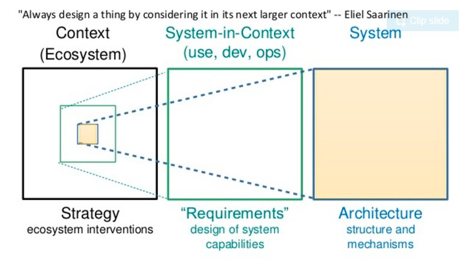

# On Designing a System-in-Context

_Diagram courtesy of [Ruth Malan](https://twitter.com/ruthmalan/status/765217156644478976)_

"Always design a thing by considering it in its next longer context." -Eliel Saarinen

I've been studying this diagram to try and glean some truths from it. It seems like there's some "deep structure" here that I would do well to elaborate.

First, an observation: Every system exists within a larger system. The act of drawing boundaries about what's "inside" a system and what's "outside" a system is more art than science. When we engage in design, we must decide what sub-system of the universal system of reality we're trying to model.

This diagram leverages that core idea: systems are always nested within other systems, to describe an artifact, be it a building or a software system, within its larger context.

Now, let's discuss the three boxes. We could begin with a bottom-up, which would be left-to-right, or a top-down analysis, which would be right-to-left.

## Architecture
When we speak about a system's architecture, whether we're talking about a software system or a building, we're usually referring to the inert materials, their relationships, and the "structures" we've created. 

How does it work? How do the parts interact?

The activity at this level is "make it work."

## Requirements
Requirements of a system are an emergent result of the system in a context of use. 

What is a context of use? Software systems typically have different users who interact with it in different ways. There are developers who interact with the "behind the scenes" nature of the system. There are users of the software who interact with the aptly-named "user interface." There's an ops team who thinks in terms of servers and support systems. Not to mention product managers, executives, project managers; each has a different "context" for interacting with the system.

What should the system do within this context? Within any given context, a set of requirements emerge for the system.

The activity at this level is designing the system's capabilities.

## Ecosystem or Context
I prefer the term ecosystem to encapsulate the entirety of all contexts of use for the system. Within any given ecosystem, there are a variety of contexts of use, or systems-in-context, some overlapping, some disjoint.

The diagram implies that strategy is most effectively applied at the level of the _ecosystem_. This is sensible, since systems-level interventions are most effective when they consider all actors.

How does this ecosystem relate? How do the various contexts of use interact with each other?

The activity at this level are systems-level interventions: changing the relationships between contexts, adding new contexts that create balanced feedback loops.

## Why this matters
There are three levels of design when it comes to designing a system:
- There's the architecture, what one might call the "technical" embodiment of the solution.
- There's the solution within a context of use, what one might call the "socio-technical" embodiment.
- And there's the overall ecosystem, the relationships between the various contexts.

We can direct our design efforts within any individual "levels", but we will be most effective when we take into account the other  levels.

Thus, "always design a thing by considering it in its next longer context."

---
Related: See [Making Architecture Matter](https://www.youtube.com/watch?v=DngAZyWMGR0) - the architecture of the system isn't relevant for the user, except insofar as the system the user interacts with _is_ the system that the developer builds. Architecture matters in that a system well-architected for the developer will make it easier for them to quickly build resilient and useful software for the user, which is where the value is created.