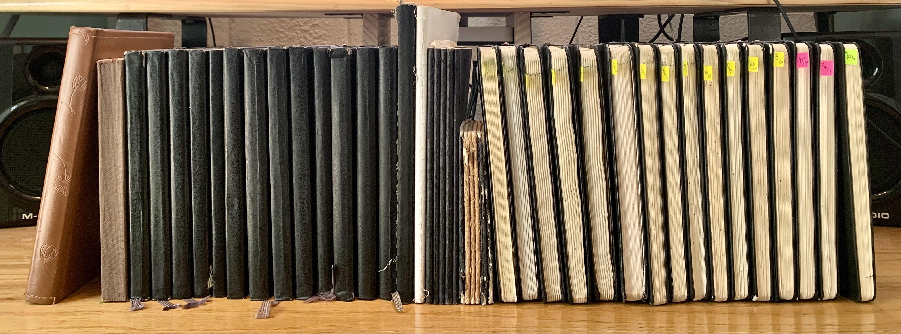
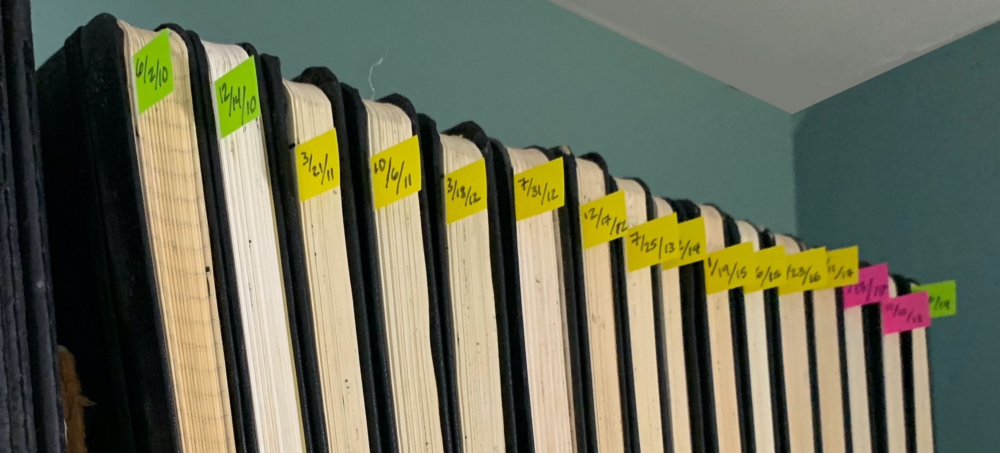
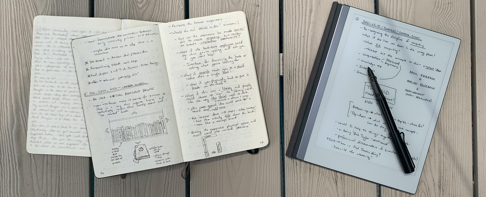

# The End of Paper

Over the last fifteen years, I've filled twenty-nine Moleskines from cover to cover. Yet within a few minutes of laying hands on the reMarkable tablet, I knew I'd never buy another paper notebook. It's just _that good_.

How was I convinced to abandon a decade-old allegiance to analog in under ten minutes? Well, let's just say the reMarkable tablet is aptly named.

Before I recount my reMarkable experience, I'll linger on my long love affair with paper. Then I'll describe the "analog-digital divide" in my daily workflows and some of the attempts I've made to bridge that gap. Finally, I'll talk about what's great about reMarkable, and what I'm looking forward to in the future.

Let's jump in.

## My love affair with paper

The first dated entry I could find from one of my paper notebooks is April 4, 2000: my eighteenth birthday. The writings began as the overwrought ramblings of a passionate high schooler. Throughout [undergrad](http://cs.trinity.edu/) and into [grad school](https://cs.unc.edu/), I continued to write frequently but haphazardly, not really establishing a structured habit for my usage of paper.

But beginning in 2006, I got serious. Grad school was challenging, and I needed new habits to carry me through. I began carrying a paper notebook with me everywhere. And I mean everywhere. I started my day by cracking it open, carried it to all my meetings, lunches, church, travel, everywhere. Notebook-carrying became such a fixture of my identity that by 2010 the write-everything-down habit was hilariously caricatured by a friend in a skit: he acted out me on a date with my wife, studiously hunched over a 2 foot by 3 foot cardboard notebook, writing down every word of our romantic conversation.

I wrote nearly every day. And my system evolved over time. What began as a single all-purpose notebook became two specialized notebooks: a daily working log and a long-form personal journal. I experimented with different formatting techniques for pages and dabbled in a variety of paper-based GTD systems. I tried out different form factors: soft cover, hard cover, small, medium, large, lined, unlined, grid. I scribbled my way through sheafs of dead trees.

And I loved it.

There was no better way to start to a day than with a fresh page, jotting down the date, and opening myself to the possibilities in front of me. I loved dedicating time to look back on life, sorting through emotions, chasing runaway thought-trains, and wrangling half-made plans. From brain to hand to pen, the ink flowing onto the page created a black-and-beige clarity that seemed more difficult when staring at a glowing rectangle or typing at a keyboard.

All that's to say, I was and am still deeply in love with paper. But, not paper for paper's sake, but rather what paper has enabled: the medium allows my thoughts to flow freely, concretize, take on shape and form, to sing.

## Digital diversions

Perhaps unlike many notebook aficionados, I have always been a digital native. So while the evolution of my pen and paper system was extensive, it isn't the full story.

I got my first job as a software developer in 2003. Which means I typed. A lot. My keyboard was often the most expedient tool for making quick notes.

It began with simple "scratch notes." I would outline how I planned to tackle a problem or note something I wanted to remember later in the day. Eventually, I found myself needing to recall something from a previous day or share something with a colleague. My "scratch notes" became a proper pile.

And I soon experienced the merciless onslaught common to all digital work: the todo. GTD, Agile, Kanban, Kaizen, sticky notes; tasks abounded, as they do. The interminable todo lists accumulated in my scratch notes but also poured over into my paper notebooks. Todos sprouted legs, becoming rants, rambles, and eventually robust articles.

In 2011, faced with that pile of notes and tasks scattered across git repositories, directories, emails and task management systems, I decided my digital note-taking needed a system of it's own. I signed up for [Simplenote](https://simplenote.com/) and began centralizing all my digital writing under a single roof.

In tandem with my paper note-taking practice, I iterated on my digital note-taking process. Over the next decade, I migrated to [NVAlt](https://brettterpstra.com/projects/nvalt/) and then [Bear](https://bear.app/), bringing my growing collection of notes with me each time. Task-tracking underwent it's own changes: from paper notebooks, to todo apps like [Wunderlist](https://en.wikipedia.org/wiki/Wunderlist), then [Todoist](https://todoist.com/), and finally to a single plain markdown file.

If you're really into organizational systems, I recorded a [livestream](https://www.youtube.com/watch?v=KgPbX-FjwyM) where I whiteboarded my reading, writing, and note-taking systems.

Today, I have over 700 notes spanning a decade, including this article, and my organizational systems continue to mature, though I've never felt quite satisfied.

## Digital's advantages over paper

In my decades of experimentation, I've found that my digital note repository does have advantages over my multitude of Moleskines.

**Search.** I can instantly summon all the digital notes I've written in the past decade containing a search term. This is tremendously helpful when I know what I'm looking for and I want to go there right away.

Conversely, my paper notebooks have no magical search capabilities not avaiable in stores. Each notebook is organized linearly, with each day's consecutive note following the previous ones. I attempted to use indexes and break up sections by topic, but it never stuck.

**Organization.** In addition to search, digital notes can be organized in a variety of non-linear ways, including tags and folders. While tags and folders sound helpful, surprisingly it hasn't proved as valuable as I expected. I sometimes use a specific tag to focus in on a set of notes and "hide" my other notes, but for some reason, a hierarchical tagging system hasn't really helped me. However, there are early signs that [wiki-style hyperlinks](https://en.wikipedia.org/wiki/Hyperlink) may prove more valuable in my workflow.

When it comes to paper, I have often dreamed of removing all my notebooks from their binding and having free sheafs of paper that I could sort, stack, and interleave. Alas, it has remained a dream. Currently, I just have tabs that allow me to quickly jump to a specific date.

**Sharing and collaboration.** I love the ease with which I can share a digital note with coworkers or migrate them to a collaborative document like Google Docs or Notion. Recipients can annotate and introduce their own edits, a key enabler of collaboration.

Paper is still far too difficult to share. Even with ubiquitous smartphone cameras, wifi, and apps to quickly "scan" a document (I use the excellent [Office Lens](https://apps.apple.com/us/app/microsoft-office-lens-pdf-scan/id975925059)), it's still not as easy to share paper as it is digital text. 

**Digital workflow integration.** Digital text is incredibly flexible. For instance, I'm writing this article in Bear. When I'm finished, I'll move the text to my [personal website](https://github.com/jessmartin/jessmartdotin-gatsby), add some frontmatter at the top, check it into source control, and the article will instantly appear as an HTML page on my website. That magical experience is made possible by a structured text format called Markdown. This is just one example of integration into a digital workflow. Text can be inserted, extracted, and transformed, all via simple scripts. That's simply not possible with paper.

**Archival.** If my house were on fire, the first (non-living) thing I would grab would be my notebooks. I once lost a half-filled notebook, a series of notes I was taking while living in Ireland. It's still a little painful to think about. I never worry about losing my digital notes.

**Iteration.** Digital notes can be modified. It's just text! I frequently revisit, extend, and adapt my digital notes. It's something I actively try to get better at. But once something is laid to paper, it can't really be changed.

Despite digital note-taking's many advantages, the devices I've used to date (and there are many!) lack the romance of paper. No device captures the _feel_ of sitting down with a piece of paper and letting the ideas flow.

Or at least that's what I thought.

## Why the reMarkable has stolen my heart

I say "holy smokes" way too often.

The reMarkable tablet arrived one November day in the middle of me recording a [livestream](https://www.youtube.com/watch?v=SDWjvhd98DI). I decided I would unbox and document my first experience on the stream. The video speaks for itself:

<iframe width="560" height="315" src="https://www.youtube.com/embed/W7hWbSxIvns" title="reMarkable 2: First Experience" frameborder="0" allow="accelerometer; autoplay; clipboard-write; encrypted-media; gyroscope; picture-in-picture" allowfullscreen></iframe>

If you made it through my fifteen utterances of "holy smokes" in seventy-five seconds, you also got to see the magic moment where I realized that this little tablet was actually going to _replace_ my paper notebook.

### It feels like writing on paper

As I mentioned in the video, writing on reMarkable feels extremely close to writing on paper. It's difficult to describe without experiencing it. The combination of reMarkable's marker scraping across the tablet surface produces three distinct sensations:

**Texture.** reMarkable eschews the typical "hard plastic on glass" feeling of writing on an iPad with the Apple Pencil. Instead, it feels like the fine grain of a lead pencil scraping across a lightly-textured paper. The resistance is delightful. I feel more accurate with each stroke, more connected to the surface.

**"Sinkiness."** Somehow, I feel like I'm actually pressing _into_ the surface of the tablet with the tip of the marker. There's _give_ to it, just like paper.

**No (or very little) glare.** reMarkable's screen looks great in full sunlight. The surface of reMarkable is an e-ink screen, similar to the Kindle, but slightly more matte in appearance. Unlike the iPad or a computer screen, it reacts like paper. Side benefit: no blue light at night!

### It does one thing well

You can only do three things with reMarkable: write, read (and annotate) a PDF, or read (and annotate) an eBook. That's it.

There's no email. No web browser. No social features. No notifications. You can write or you can read. There's not even a clock.

[Some](https://www.wired.com/review/remarkable-2/) [reviewers](https://appleinsider.com/articles/21/03/29/review-remarkable-2-is-better-than-ipad-for-notes-but-nothing-else) complained about reMarkable's price tag given it can _only_ be used for writing and reading. They are entirely missing the point. In a world of sub-hundred dollar tablets that run every app under the sun, reMarkable's focus sets it apart.

Paradoxically, I'm perfectly willing to pay _more_ for a device that does less. Rather than getting pounded into the ground by the incessant notifications of the digital domain, reMarkable provides a serene focus on the few things that actually matter, while still giving me the advantages of digital content.

### It feels built-to-last

I took my paper notebooks everywhere. They got lugged around in a stack of books, tossed onto tables, unceremoniously buried in backpacks. They got littered with crumbs as I scrawled an idea over lunch, and spilled on by careless children. To replace paper, the reMarkable must match or exceed that durability. I'm happy to report that reMarkable's metal case, fabric folio, and comfortable weight feel up to the challenges of everyday life.

Moleskines were a delight to carry and use, a beautiful marriage of form and function. reMarkable evokes that sense of an objet d'art with clean lines, easy textures, and cool metal.

I expect to be carrying reMarkable everywhere for the next decade.

### Hopes for the future of reMarkable

The reMarkable tablet has replaced my notebook, but it's only one step in the direction of digitizing my note-taking practice. Yes, every note is now stored as digital scribbles, automatically synced to all of my devices, and I can carry with me every note I've ever written. Replacing my notebooks with a digital version is seriously impressive!

But many of the drawbacks of the analog notebook persist.

**Notes aren't searchable.** I continue to use my time-ordering system of writing a new note each day and grouping notebooks into months in order to easily "jump to" a date. But my scribbles are not yet searchable text. They could be! Digitizing my notes is step one. I'm hopeful that reMarkable will start automatically transcribing notes in the future and support robust search.

**Bring your own workflow.** The reMarkable is a delightfully hackable device and there's a [solid community of software add-ons](https://github.com/reHackable/awesome-reMarkable) that extend the reMarkable's capabilities. But that's left as "an exercise for the writer." The built-in workflows are extremely rudimentary: effectively, it's just sync.

While the reMarkable is an incredible piece of hardware, the software is merely serviceable. In my mind, I believe they've solved the hardest problem already. Think of it like a Tesla. The hard part is re-platforming the car. Well, my notes are now re-platformed. Everything else is just a software update.

Here's hoping for some great software updates!

## A life-changing device

It's exceedingly rare to buy a device that changes your life. And yet, the reMarkable has done just that: the reMarkable tablet marries **the ambiance and focus of paper with the utility and integration of the digital world.**

There's still a lot of work to do to integrate my instantly-digitized "paper" notes into a larger digital workflow. I'll address those workflows in a separate article. But here's how my life is different today:

- I no longer carry around 2 (or more) notebooks - my reMarkable houses both my daily working log and personal journal in separate "notebooks." In fact, _all_ of my past notebooks are on the reMarkable as well! I can refer back to notes from months ago, long after the completed Moleskine would have been left on a shelf at home.
- My "paper notebooks" are now (almost) immediately available digitally via reMarkable's cloud sync service. If I want to share a page or diagram, it's a simple process to grab the page via the app on my Mac.
- reMarkable doubles as a reading device for PDFs and has improved my reading workflow. I used to print out papers I wanted to read and haul them around. Now I have them all on my reMarkable, with full ability to highlight and annotate as I read.

I'm excited to see what the next decade holds. It feels like we've passed an important threshold: **an affordable digital tablet can now recreate the experience of writing on paper.** I suspect we'll find ways to further improve the writing experience, but I'm most looking forward to a deeper workflow integration between the analog and the digital.

### How do I love thee?

A few days ago, I misplaced the marker for my reMarkable. (You need an [EMR stylus](https://essentialpicks.com/emr-stylus-how-wacom-pens-work/) in order to write on a reMarkable - regular stylii don't work!) I felt a distinct feeling of loss - not being able to jot notes on my reMarkable throughout the day was almost physically painful.

As they say, sometimes you don't realize how much you love something until you lose it. Fortunately, I recovered the marker a few days later, much to my relief. I really do love this little notebook!

_More questions? If you're curious about how I use my reMarkable or my note-taking practices, reach out on [twitter](https://twitter.com/jessmartin)._

