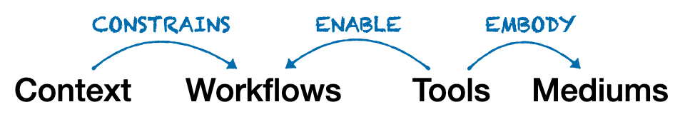
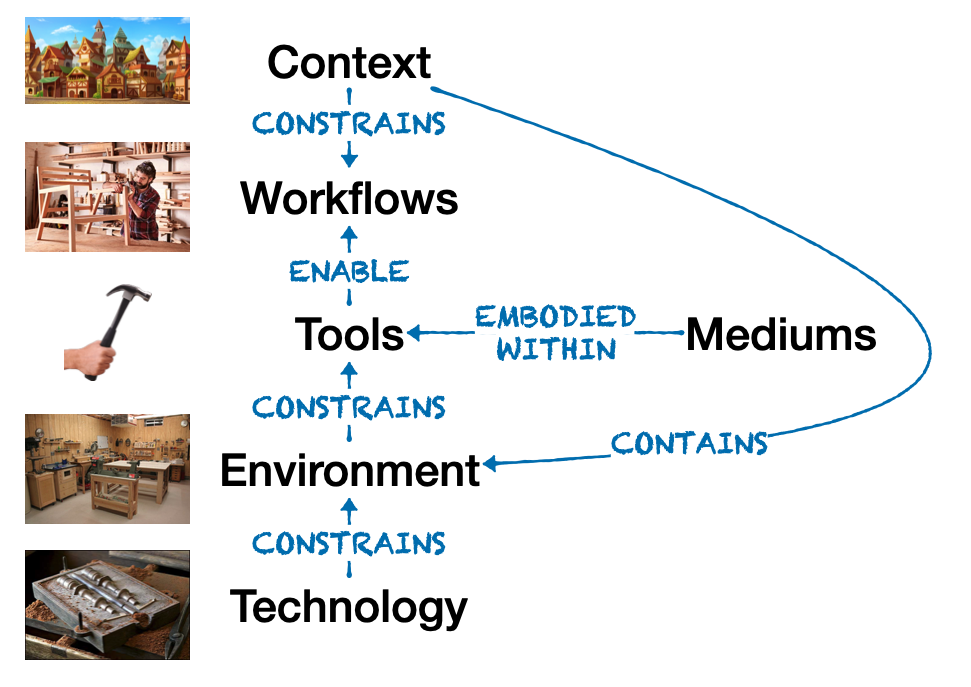

# Tools embody mediums

We talk in general terms about Tools for Thought, and I think that term is too vague to be useful. 

I propose the following definition of a tool, which I'll then unpack below:
> A tool is an embodiment of one or mediums that enables workflows within a specific context.

## Mediums

I prefer [Ted Nelson's definition](http://worrydream.com/refs/Nelson%20-%20The%20Crafting%20of%20Media.pdf) of a medium:
> "A medium is a set of presentation elements, and relations among them, that may be used by a person to create an object, environment or experience for someone else."

There are actually many different medium for thinking. Mediums for thinking are in turn mediums for communication because communication is always about the encoding of human thought in some form.

A medium for thinking and communication is a rare and special thing, and there are actually quite few of these in all of human history. Like Plato's ideals, Mediums never exist in the concrete, but always must be incarnated, with tradeoffs, into specific tools.

Mediums can be generalized across many different tools, though their application within a specific context will vary tremendously depending on the targeted workflow.

## Tools

A particular tool will employ one or more mediums in order to enable a specific workflow for a specific set of users within a context.

Context-free tools don't exist, and this is one reason why we should focus on [building tools around workflows, not workflows around tools](https://thesephist.com/posts/tools/). (By the way, this is the same insight behind the [Jobs To Be Done framework](https://jobs-to-be-done.com/jobs-to-be-done-a-framework-for-customer-needs-c883cbf61c90), just applied differently.)

Tools are always embedded within a specific context. One challenge of a toolmaker is how generalizable to make their tool versus specific. Because tools enable workflows, the more configurable and general the tool, the less fitted it is to a specific person's workflow and context.

The ambition of many tools for thought makers today is that they are trying to invent a new medium for thinking, and that's actually quite rare. The pretentiousness of those makers is that they elevate their particular tool to the level of a medium, which is a misunderstanding and an overstatement.

## Workflows
Workflows are a set of processes that we use to accomplish a goal. 

To make this concrete, I have a workflow around reading that includes the way I research, select, and collect reading material, from books to essays and articles, the times and places where I read them, the practices I use during and after reading. All of these processes fit together to form my reading workflow. There are a dozen or more tools I use, most of which don't interoperate in any meaningful way, and span the digital and the analog. My reading workflow spans days and weeks, and locations ranging from my office, my bedroom, park benches, in cars and on planes.

To state that I have a reading workflow is not a claim that my workflow is entirely conscious, well-formed, refined, or even explicit. Most workflows are actually implicit, full of gaps, with much room for optimization.

To make it even more mundane, I bet that you have a workflow for drinking coffee. That may involve complicated tools and measurements on your part or it may involve acquiring that coffee from someone else.

## Context
Any workflow exists within a larger context. This context includes time and spatial elements, environmental constraints, societal and personal characteristics. The context acts as an "outer bound" to the [possibility space](https://shapeofplay.wordpress.com/2013/08/02/possibility-space/) of the workflow, which then guides the design and tradeoffs of the tool itself, including which specific mediums are employed by the tool.

## Technologies and Environments
What about general-purpose technologies and environments?

## Technology
What about technologies? What role do they play in all of this? Technologies are the underlying capability set that limit the possibility space of tool development.

For example, we don't yet have adequate technology to make 3D spreadsheets practical and useful. The medium already exists! We could design workflows in specific contexts where it would be useful. But the current limitations of VR and AR hardware and interfaces make interacting with 3D content cumbersome, and therefore the tool is not there.

## Environments 
Environments exist to enable tools and their interoperability. 

The Operating System is the canonical environment. This is distinct from the context, which is the external reality in which the environment lives. The context contains the environments, which then create constraints for the tools deployed in that environment.
